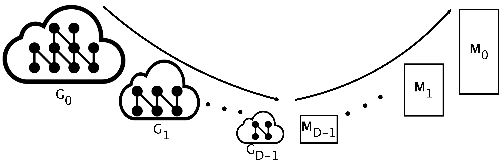

# GOSH: Embedding Big Graphs on Small Hardware
**GOSH** is a *GPU-based* graph embedding tool that takes a graph and produces *d*-dimensional vector for every node in the graph. The embeddings can then be used for a multitude of machine learning tasks including node classification, link prediction, graph visualization, and anomaly detection.


**GOSH** employs a novel *coarsening* algorithm (MultiEdgeCollapse) to compress the graph into smaller graphs and embeds the smaller graphs to produce very accurate embeddings very quickly. Besides, it uses a special scheduling algorithm to embed any graph using a single GPU - even if the memory requirement of the graph exceeds that of the GPU.

Getting Started
=========
Requirements
----------------
We compiled this program with `nvcc` using `CUDA 10.1`and ran it on `Ubuntu 4.4.0-159`. 

Compiling
----------
You can build the executables of the project with a single command. Simply clone the repo, navigate to it and call the `make` command:
```
git clone https://github.com/SabanciParallelComputing/GOSH
cd GOSH
make clean && make
```
This will produce two executables:
```
execs/gosh.out # this executable takes inputs as flags and options. 
execs/gosh_nargparse.out # this executable takes all the parameters as a sequence of strings and none of the parameters are optional
```
Executing
-------
The most basic execution of GOSH can be done as follows:
```
execs/gosh.out --input-graph $string --output-embedding $string --directed $number --epochs $number
```
- `--input-graph $string`:
An edge list file with the vertex IDs as zero-indexed integers. i.e, the file should be of the form:
```
i j
k l
...
a b
```
Where `i, j, k, l, a, b` are vertex IDs from the graph. Please note that *all vertices will get embeddings - even those without any edges.*
- `--output-embedding $string`:
The file to which the embeddings are to be printed. The embeddings can either be printed as an ASCII formatted text file or a binary file (can be triggered with the `--binary-output` flag).
The output format in ASCII text is as follows:
```
num_vertices dimension
0 e_1 e_2 e_3 ... e_dimension-1
1 e_1 e_2 e_3 ... e_dimension-1
...
num_vertices-1 e_1 e_2 e_3 ... e_dimension-1
```
Where `num_vertices` and `dimension` are the number of vertices and the embedding dimensionality, respectively, and every line afterward corresponds to a vertex from the graph. A line starts with the ID of the vertex and is followed by its embeddings. All elements within a line are space-separated.
- `--epochs $number`: The number of epochs to run on the entirety of the graph. Running an epoch on a graph Gi which has been coarsening *i* times corresponds to running |V*i*| positive samples on that graph. 
    - *Note:* the strategy in which the epochs are distributed across different levels of coarsening can be tuned using the options `--epoch-strategy` and `--smoothing-ratio` and are discussed further below.
- `--directed $number`: Whether the graph is directed (1), undirected (0), or passed as in a Binary Compressed Sparse Row format (2).

## Optional Parameters
Many optional parameters can be used to fine-tune the embedding:
### Global parameters
- `-d --dimension $number`: an integer with the dimensionality of the embedding.
- `-s --negative_samples $number`: number of negative samples used with every positive update.
- `--negative-weight $float`: a scaling factor used with negative samples to scale the gradients to be used when updating embeddings during negative updates.
- `--device-id $nummber`: the ID of the GPU device to be used during the embedding.
- `--binary-output`: whether the outputs are printed in binary format for compactness and ease of processing on memory. The format of the binary output is as follows:
    - The number of vertices as a signed integer
    - The embedding dimension as s signed integer
    - The embeddings of all the vertices printed sequentially as single precision floats in C++.
### Sampling parameters
- `--sampling-algorithm $number`: the method used to create positive samples during training. Currently, two sampling strategies are implemented: 
    - `--sampling-algorithm 0`: 1-hop neighbor sampling or PPR sampling as described in [VERSE](https://arxiv.org/abs/1803.04742). Depending on the value of `--alpha`. 
        - `--alpha 0`: positive samples for a node are sampled from its direct neighbors 
        - `--alpha > 0 && --alpha < 1`: positive samples of a node are nodes reached after performing a Personalized Page Rank random walk, with `--alpha` being the damping factor as defined in [VERSE](https://arxiv.org/abs/1803.04742).
    - `--sampling-algorithm 1`: random-walk based sampling. With this method, random walks are generated on the CPU and samples are extracted from them and sent to the GPU. It is controlled with three parameters:
        - `--walk-length $number`: length of each random walk.
        - `--augmentation-distance $number`: within a walk, from each sequence of `$number$`, all the pairs of nodes are used as poisitive samples.
        - `--sample-pool-size`: the number of samples to be added to the pool on the CPU which is copied to the GPU.
- `-a --alpha $number`: A value for the positive sampling strategy to be used in the model based on [VERSE](https://arxiv.org/abs/1803.04742). `alpha = 0` will use an adjacency similarity positive sampling approach while `0 > alpha > 100` will use PPR with `alpha/100` as its damping factor.
 ### Learning Rate Parameters
- `-l --learning_rate $float`: The global learning rate of the model.
- `--learning-rate-decay-strategy $num`: The strategy used to decay the learning rate during a level and between different levels. There are four strategies (0/1/2/3), their differences are shown below:
    - 0, 1: At every level, learning rate decays linearly from the initial learning rate starting at the first epoch until the last epoch based on the following equation:
    ```
    current_learning_rate = (max(1-current_epoch/total_epochs), 1e-4)*initial_learning_rate
    ```
    where `current_epoch` and `total_epochs` are the current and total epochs for the current coarsening level.
    - 2, 3: The learning rate at the end of a level i is the same as it is at the beginning. No decay.
    - 1, 3; initial learning rate for every coarsening level differs based on the following heuristic:
    ```
    lr_i = lr;  if  |Vi| < LR_REV_NV
    lr_i = lr/sqrt(|Vi|/ LR_REV_NV); otherwise
    ```
    Where:  
    `lr` = input learning rate (global)  
    `lri` = initial learning rate at coarsening level *i*.  
    `LR_REV_NV` = tunable hyperparameter in the `src/main.cu`

    - 0, 2: initial learning rate at each level is the same as the original learning rate given as input
### Coarsening Parameters
- `--no-coarsening`: will not apply any coarsening and will run the embedding directly on the original graph.
- `--coarsening-stopping-threshold $num`: the number of vertices to stop coarsening at. i.e, when a graph G*i* is generated having |V*i*|< `$num`, it will be added to the coarsened set, but the coarsening will not continue.
- `--coarsening-stopping-precision $float`: the accpetable shrinkage of a graph during coarsening. i.e, if graph G*i* is coarsened into graph G*i+1*, and |V*i+1*| > |V*i*| * `$float`, graph G*i+1* is *not* added to the coarsened set and coarsening will not continue.
- `--coarsening-matching-threshold-ratio $num`: controls the total number of matches allowed per vertex. Given a graph G*i* coarsened *i* times, a vertex in G*i* is not allowed to match more than `i * i * ($num / |Vi|)` vertices.
- `--coarsening-min-vertices-in-graph $num`: the minimum number of vertices acceptable in a graph to be added into the coarsened set, i.e, if a graph G*i* is coarsened into a graph G*i+1* and |V*i+1*| < `$num`, the graph G*i+1* is not added to the coarsened set.
### Epoch Distribution Parameters
- `--epoch-strategy`: choose the strategy to use to distribute epochs across levels, there are multiple strategies available:
  - *fast*: The smallest graph is given half of the total epochs and the next level is given half of that, and so on.
  - *s-fast*: `COARSE_SMOOTHING_RATIO * total_epochs` epochs are distributed equally across levels, while the remainder is distributed based on the *fast* rule.
  - *normal*: equal distribution of epochs across levels.
  - *accurate*: The opposite of fast; the biggest graph is given half of the total epochs and, the smaller level is given half of that, and so on.
  - *s-accurate*: `COARSE_SMOOTHING_RATIO * total_epochs` epochs are distributed equally across levels, while the remainder is distributed based on the *accurate* rule.

 NOTE: in all of the aforementioned rules, a level is allocated a minimum of 1 epoch.
- `--smoothing-ratio`: the smoothing ratio used in distributing epochs for the smooth strategies, i.e *s-fast* and *s-accurate*.


### Large Graph Parameters
- `--epoch-batch-size $num`: the number of epochs to run per large graph execution round, where a single round consists of a full rotation over all the embedding part pairs.
- `--num-parts $num`: the number of embedding parts to store concurrently on the GPU.
- `--num-pools $num`: the number of sample pools to store concurrently on the GPU.
- `--sampling-threads $num`: the number of threads to work on sampling in parallel.
- `--concurrent-samplers $num`: the number of sample pools to be sampled into concurrently, where a single pool can be sampled into by a maximum of `sampling-threads / concurrent-samplers` threads.
- `--task-queue-threads $num`: the number of threads to execute tasks from the task queue.
- `--num-sample-pool-sets $num`: number of sample pool sets.

# Authors
[Amro Alabsi Aljundi](https://github.com/AmroAlJundi), [Taha Atahan Akyildiz](https://github.com/Atahanak), and [Kamer Kaya](http://people.sabanciuniv.edu/kaya/).
# Acknowldegments
- Adapted the positive sampling and embedding updates from the [VERSE](https://arxiv.org/abs/1803.04742) paper written by [Anton Tsitsulin](http://tsitsul.in/), [Davide Mottin](https://mott.in/), [Panagiotis Karras](https://scholar.google.com/citations?user=B6C4aBoAAAAJ&hl=en), and  [Emmanuel Müller](https://scholar.google.com/citations?user=gg0HkEsAAAAJ&hl=en) 
- Used the Argparse header for C++ written by [Hilton Bristow](https://github.com/hbristow) to process CLI inputs: https://github.com/hbristow/argparse
# Citation
If you find our code useful for your research, please cite us:
```
@ARTICLE{9623416,
  author = {Alabsi Aljundi, Amro and Akyildiz, Taha Atahan and Kaya, Kamer},
  journal = {IEEE Transactions on Parallel and Distributed Systems}, 
  title = {Boosting Graph Embedding on a Single GPU}, 
  year = {2021},
  volume = {},
  number = {},
  pages = {1-1},
  doi = {10.1109/TPDS.2021.3129617}
}
@INPROCEEDINGS{9377898,
  author={Akyildiz, Taha Atahan and Alabsi Aljundi, Amro and Kaya, Kamer},
  booktitle={2020 IEEE International Conference on Big Data (Big Data)}, 
  title={Understanding Coarsening for Embedding Large-Scale Graphs}, 
  year={2020},
  volume={},
  number={},
  pages={2937-2946},
  doi={10.1109/BigData50022.2020.9377898}
}

@INPROCEEDINGS{10.1145/3404397.3404456,
    author = {Akyildiz, Taha Atahan and Aljundi, Amro Alabsi and Kaya, Kamer},
    title = {GOSH: Embedding Big Graphs on Small Hardware},
    year = {2020},
    isbn = {9781450388160},
    publisher = {Association for Computing Machinery},
    address = {New York, NY, USA},
    url = {https://doi.org/10.1145/3404397.3404456},
    doi = {10.1145/3404397.3404456},
    booktitle = {49th International Conference on Parallel Processing - ICPP},
    articleno = {4},
    numpages = {11},
    keywords = {GPU, parallel graph algorithms, link prediction, Graph embedding, graph coarsening},
    location = {Edmonton, AB, Canada},
    series = {ICPP '20}
    note = {Nominated for the best-paper award.}
}
```

